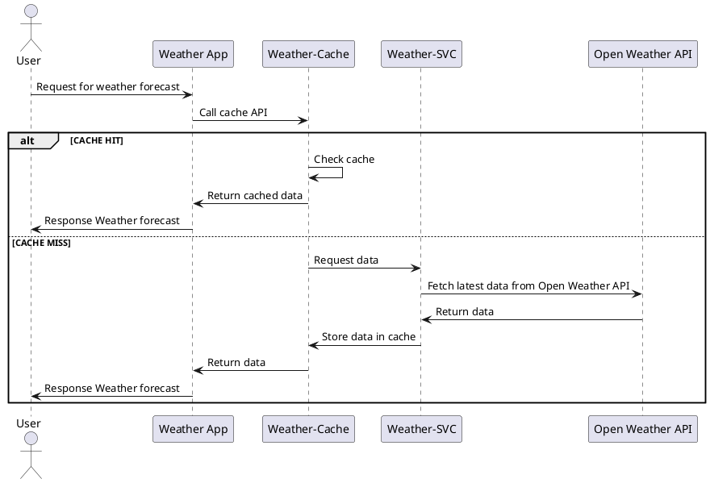

---

# Weather App Microservices

A lightweight microservices setup to fetch and cache weather forecasts for cities, using **Spring Boot**, **Redis**, and **Open Weather API**.

---

## 🧩 Architecture Overview




---

## 🚀 Services

| Service         | Port | Description                                |
| --------------- | ---- | ------------------------------------------ |
| `weather-cache` | 8081 | Spring Boot caching service (Redis-backed) |
| `weather-svc`   | 8080 | Backend API service fetching weather data  |
| `redis-db`      | 6379 | Local Redis cache                          |
| `weather-app`   | 80   | (Optional) Frontend entry point            |

---

## ⚡ Features

* **Cache-first approach**: Returns cached data if available; fetches from API only on cache miss.
* **Redis-based caching** for improved performance.
* **Dockerized services** for easy deployment.
* **Environment variables** managed via `.env` files for easy configuration.

---

## 🛠️ Setup & Run

1. Clone the repository:

```bash
git clone <repo-url>
cd weather-app
```

2. Build JARs for backend services:

```bash
./build_all_jars.sh
```

3. Start services using Docker Compose / Podman Compose:

```bash
podman-compose up --build
# or
docker-compose up --build
```

4. Access services:

* `weather-svc`: `http://localhost:8080`
* `weather-cache`: `http://localhost:8081`
* `weather-app` (if enabled): `http://localhost`

---

## ⚙️ Environment Variables

* **weather-cache/.env**

```text
REDIS_HOST=redis-db
REDIS_PORT=6379
REDIS_PASSWORD=<your-password>
SPRING_PROFILES_ACTIVE=prod
```

* **weather-svc/.env**

```text
API_KEY=<open-weather-api-key>
```

---

## 🧪 Notes

* Ensure Redis password in `.env` matches the `redis` service command if manually configured.
* For development, you can disable caching or use a test API key.

---

## 📦 Docker Images

* `openjdk:21-jdk-slim` or `amazoncorretto:21` recommended for lightweight runtime.
* Build and run containers using `docker-compose` or `podman-compose`.

---

Do you want me to also **add a short diagram for the Docker Compose structure** in the README for visual clarity?
